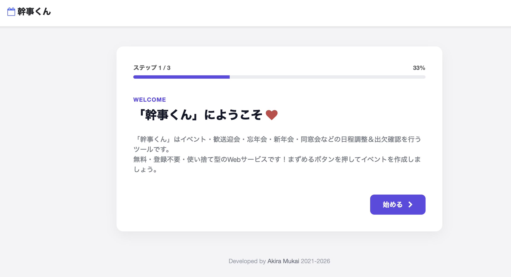

# 幹事くん (PHP Edition)

登録不要で使えるイベントの日程調整・出欠確認サービスです。

---

## ✨ Features

- 登録不要
- スマホ対応
- 日本語・英語対応
- Bootstrap 5
- PHP 8

---

## 📷 Screenshot

---

## 🌐 Demo

[幹事くん](https://tsukuba42195.sakura.ne.jp/kanjikun_2026/)

---

## 👨‍💻 Author

向井聡（Akira Mukai）

- Blog: https://s0323861.github.io/
- GitHub: https://github.com/s0323861

---

## ❤️ Support

If this project helped you, consider supporting its development.

☕ Buy me a coffee:
https://ko-fi.com/akiramukai

---

## 📄 License

MIT Licence
